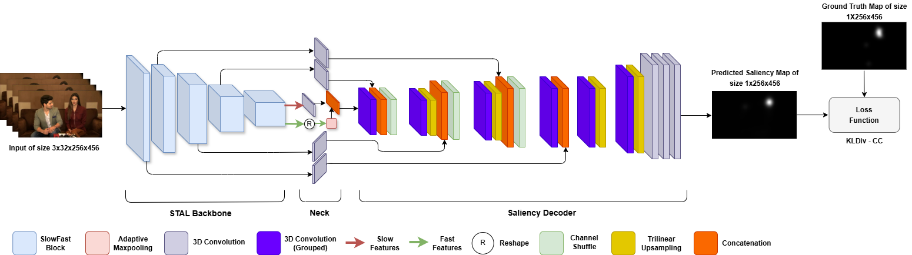

# ViNet++: Minimalistic Video Saliency Prediction via Efficient Decoder & Spatio Temporal Action Cues

-----

[](https://arxiv.org/abs/2502.00397) 
[](https://ieeexplore.ieee.org/abstract/document/10888852) 

Accepted at [2025 IEEE International Conference on Acoustics, Speech and Signal Processing (ICASSP 2025)](https://2025.ieeeicassp.org/).

----


> Comparing Ground Truth with the predicted saliency maps of our models and STSANet on three different datasets - DHF1K, UCF-Sports and DIEM.

## Abstract

This paper introduces ViNet-S, a 36MB model based on the ViNet architecture with a U-Net design, featuring a lightweight decoder that significantly reduces model size and parameters without compromising performance. Additionally, ViNet-A (148MB) incorporates spatio-temporal action localization (STAL) features, differing from traditional video saliency models that use action classification backbones. Our studies show that an ensemble of ViNet-S and ViNet-A, by averaging predicted saliency maps, achieves state-of-the-art performance on three visual-only and six audio-visual saliency datasets, outperforming transformer-based models in both parameter efficiency and real-time performance, with ViNet-S reaching over 1000fps.

## Architecture



## Checkpoint Weights
 to the checkpoint weights

## Cite

```bibtex
@INPROCEEDINGS{vinet2025,
  author={Girmaji, Rohit and Jain, Siddharth and Beri, Bhav and Bansal, Sarthak and Gandhi, Vineet},
  booktitle={ICASSP 2025 - 2025 IEEE International Conference on Acoustics, Speech and Signal Processing (ICASSP)}, 
  title={Minimalistic Video Saliency Prediction via Efficient Decoder & Spatio Temporal Action Cues}, 
  year={2025},
  doi={10.1109/ICASSP49660.2025.10888852},
  url={https://ieeexplore.ieee.org/abstract/document/10888852}
}
```

## Contact

For any queries or questions, please contact [rohit.girmaji@research.iiit.ac.in](mailto:rohit.girmaji@research.iiit.ac.in) or [bhav.beri@researchiiit.ac.in](mailto:bhav.beri@researchiiit.ac.in), or use the public issues section of this repository.

----

> This work © 2025 by the authors of the <a href="https://ieeexplore.ieee.org/abstract/document/10888852">paper</a> is licensed under <a href="https://creativecommons.org/licenses/by-nc-sa/4.0/">CC BY-NC-SA 4.0</a>    
